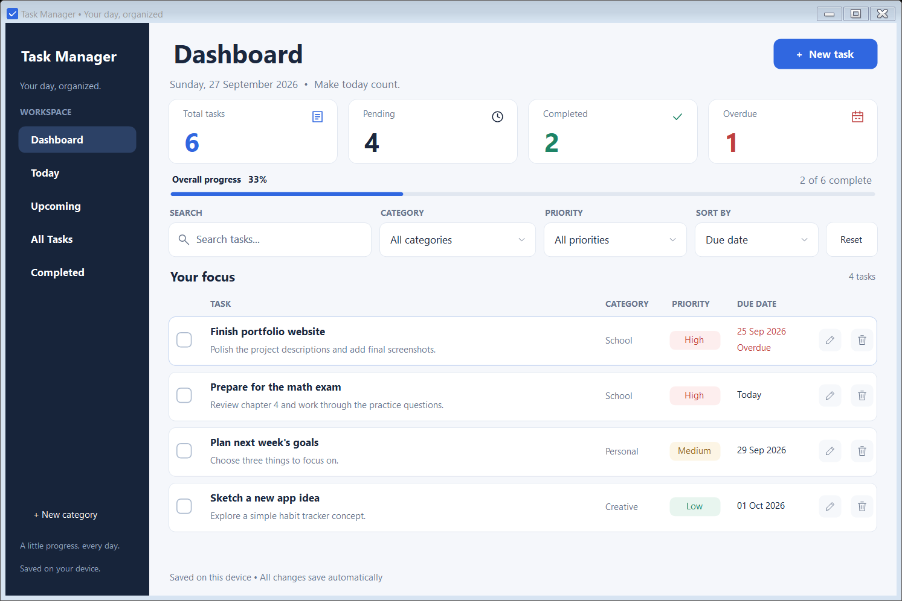
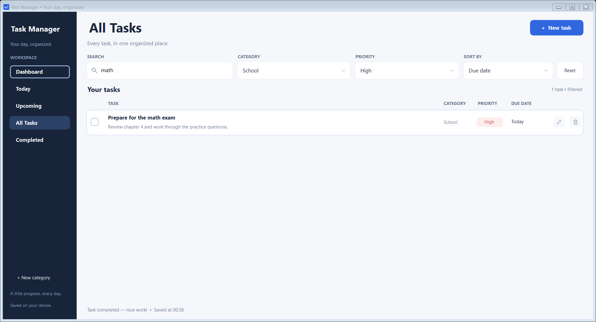

# Task Manager

A Windows desktop task planner built with **C#, .NET 8, and Windows Forms**. Organize school, work, and personal tasks in a clean dashboard, with everything saved locally on your device.

## Features

- Create, edit, delete, and complete tasks with a title, description, category, priority, and due date.
- Navigate between Dashboard, Today, Upcoming, All Tasks, and Completed.
- View total, pending, completed, and overdue counts alongside completion progress.
- Search by title, filter by category or priority, and sort by due date or priority.
- Use Personal, School, and Work categories, or create your own.
- Spot overdue tasks, confirm deletions, and receive clear validation messages.
- Work with keyboard shortcuts, accessible controls, and a resizable interface with Windows DPI scaling support.
- Automatically save tasks and categories as JSON, with backup recovery and no account or internet connection required during normal use.

## Technologies

- **C#** and **.NET 8** (`net8.0-windows`)
- **Windows Forms** with custom-painted controls and vector icons
- **System.Text.Json** for local persistence
- No third-party packages, commercial UI libraries, backend, or database

## Build and run

### Requirements

- Windows 10 or Windows 11
- .NET 8 SDK, or a newer SDK capable of targeting .NET 8
- .NET 8 **Desktop Runtime** to run the framework-dependent application; this is included with the .NET 8 SDK on Windows

Alternatively, use Visual Studio 2022 with .NET 8 support and the **.NET desktop development** workload.

### Command line

Open PowerShell in the project folder, then run:

```powershell
dotnet build TaskManager.csproj -c Release
dotnet run --project TaskManager.csproj -c Release --no-build
```

The built executable is at `bin\Release\net8.0-windows\TaskManager.exe`.

### Visual Studio

Open `TaskManager.csproj`, allow package restore to finish, and press **F5** to build and run.

## Screenshots

These screenshots use fictional tasks from the built-in self-tests, rendered at 125% Windows display scaling.

### Dashboard



### Search and filters



## Usage notes

Dashboard, Today, and Upcoming show pending tasks. Today includes tasks due on the current local date; Upcoming includes later dates. All Tasks includes completed items, and Completed shows only finished tasks. A task is overdue when its due date is before today and it remains incomplete.

Dashboard totals always describe the complete task collection. Search and filters apply to the list and remain active when changing sections; **Reset** clears them. Sorting places pending tasks before completed tasks.

| Shortcut | Action |
| --- | --- |
| `Ctrl+N` | Create a task |
| `Ctrl+F` | Focus search |
| Arrow keys in the task list | Navigate tasks and actions |
| `Enter` in the task list | Edit a task, or activate the focused checkbox/action |
| `Space` in the task list | Toggle completion |
| `Delete` in the task list | Request deletion, with confirmation |
| `Enter`, `Space`, `F4`, or `Alt+Down` on a dropdown | Open its options |
| `Escape` in an open dropdown | Cancel the selection |

Double-click a task title to edit it. Hover over a title to read its full description. In the date field, Left/Right changes the day, Page Up/Down changes the month, and Home selects today.

## Local data

Tasks and categories are stored outside the project and executable directories:

```text
%LOCALAPPDATA%\SchoolPortfolio\TaskManager\tasks.json
```

The app uses atomic file replacement and keeps the previous saved state in `tasks.backup.json`. Unreadable data is preserved before recovery is attempted. If the data cannot be safely loaded or uses an unsupported version, the app protects it with a read-only session. Failed saves leave the current task list intact and show an error.

To restore a backup manually, close the app, make a separate copy of the data folder, and copy `tasks.backup.json` over `tasks.json`. Local JSON files are not encrypted and should not be committed to Git.

## Project structure

```text
Assets/        Application icon
Diagnostics/   Built-in self-tests using isolated temporary data
Models/        Task model and enums
Services/      Task queries and JSON persistence/recovery
UI/            Forms, reusable controls, theme, and icons
docs/          Screenshots used by this README
Program.cs     Application entry point
```

## Verification

After building, run the built-in checks from the project folder:

```powershell
$process = Start-Process .\bin\Release\net8.0-windows\TaskManager.exe `
    -ArgumentList '--self-test' -WindowStyle Hidden -Wait -PassThru
$process.ExitCode # 0 means all checks passed
```

Results and test screenshots are written to `TestResults/`. The checks cover persistence and recovery, task workflows, filtering and sorting, keyboard and accessible actions, empty states, long lists, and dashboard resize/maximize/restore behavior. Tests use temporary data, not your saved tasks.

Build output, test results, IDE settings, temporary files, and local user data are excluded by `.gitignore`. Only the selected demonstration screenshots under `docs/screenshots/` belong in the repository.
